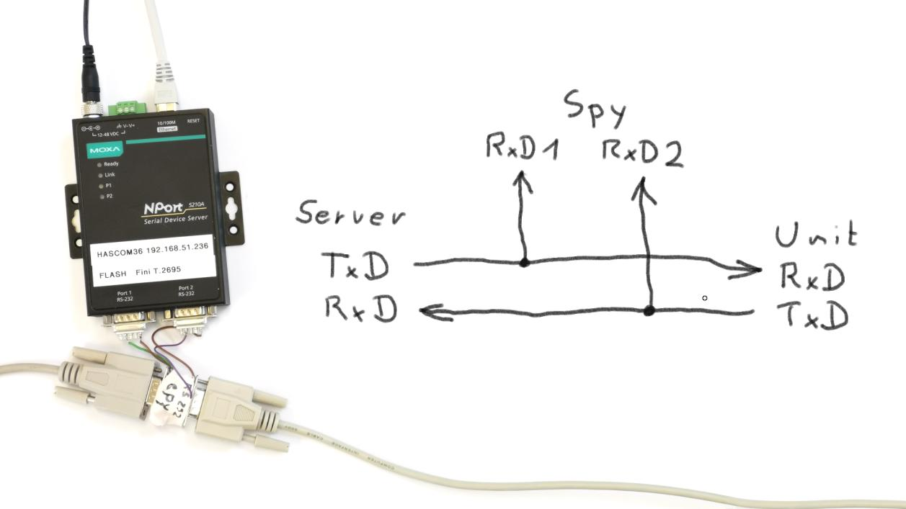
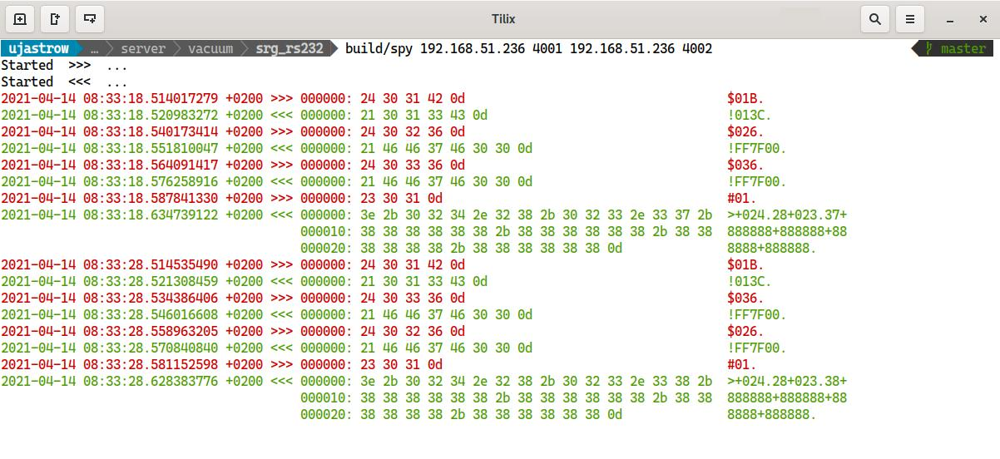

## Serial Spy

If you work with RS232 devices problems often encountered include:
* is the wiring correct
* setup
* timing
* termination character
* undocumented stuff

What I often do is using some device manufacturer supplied software and listen in to its communication. They usually know their devices best and do all the things to set it up in the correct order.

What is needed is a means to spy on them... So I finally, after tens or hundredths of hours of spending to debug a connection, I came up with this very simple solution.

Before I used a lot different things like port forwarding or wireshark. All these need more work, more understanding, and especially if you do it not very often you will forget how to set these high tech solutions up. At least I do.

### Hardware

The hardware uses a two port RS232-to-Ethernet box:

It just listens in on the transmit and the receive data. It's kind of a T connector.

### Software

And now we need to follow the two listening ports. One port listens to the "out" direction, one to the "in" direction.

And then we need a software that visualizes the traffic. It is in this repo.

You see the server's questions coming over the RS232 line in red, and the device's answers in green.

Happy sniffing ;)
